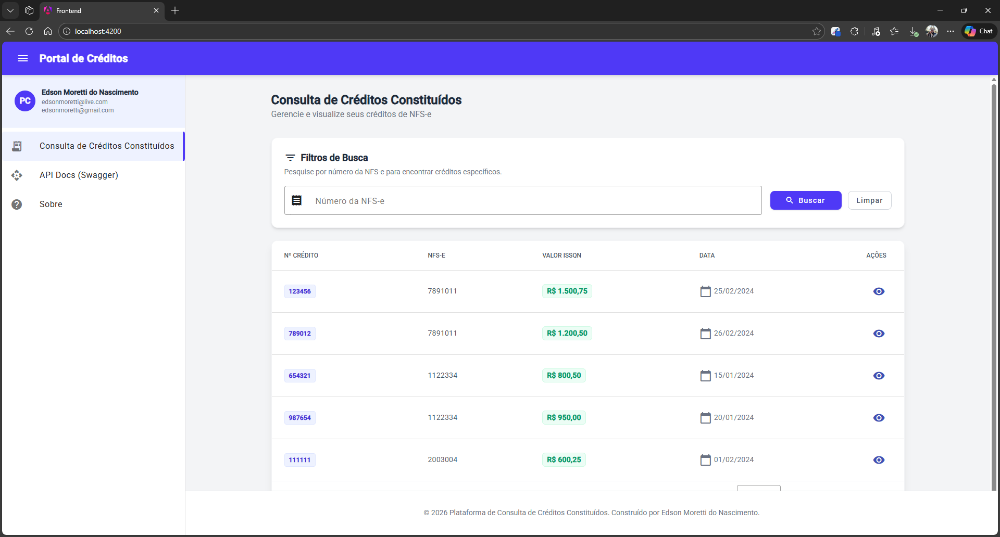
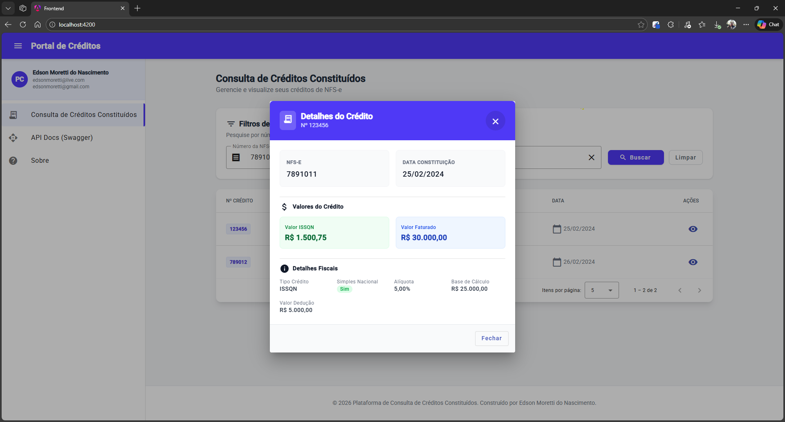
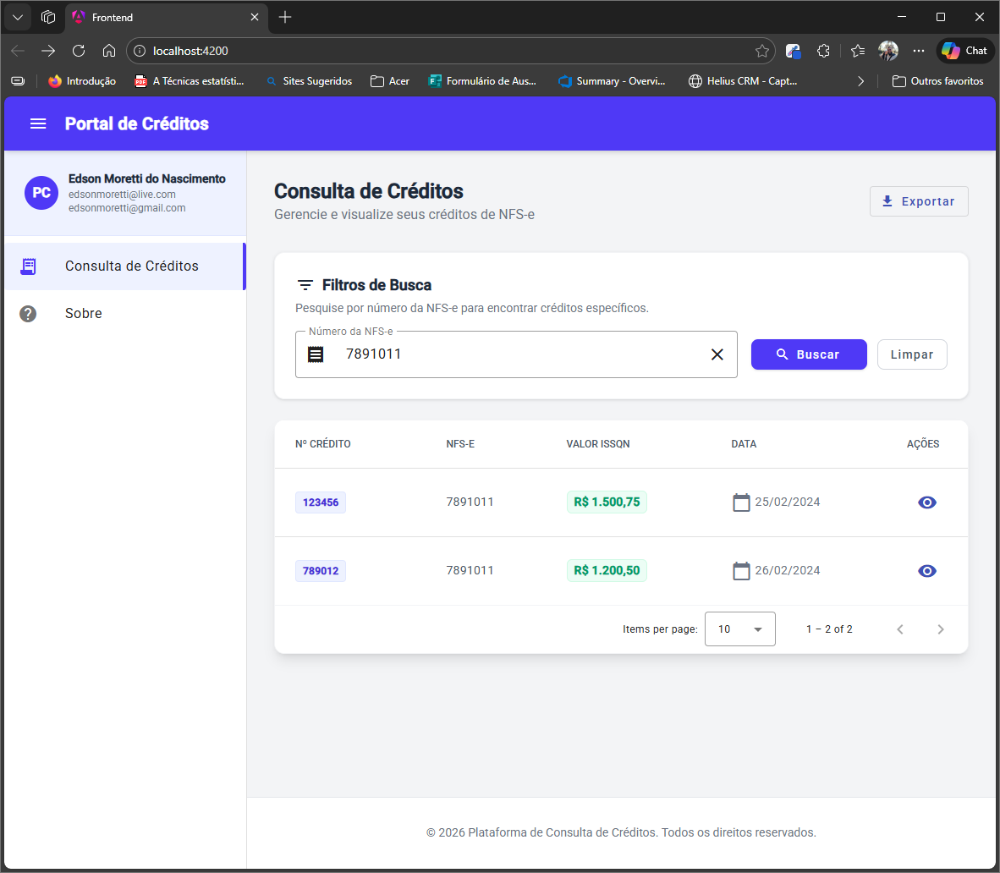
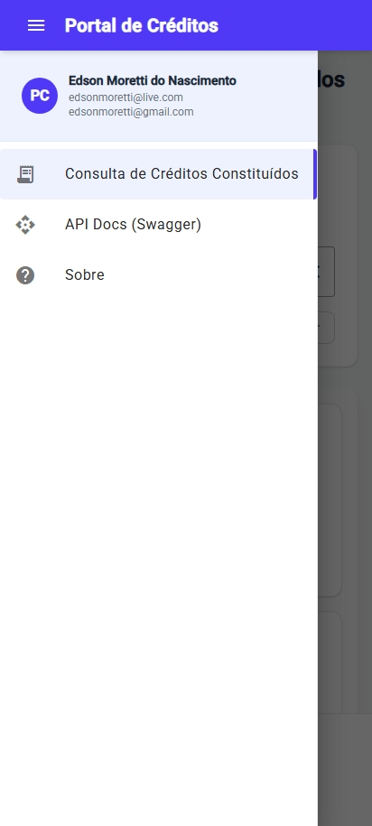
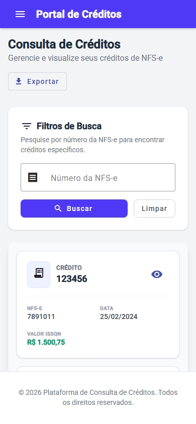
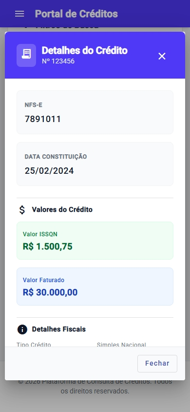
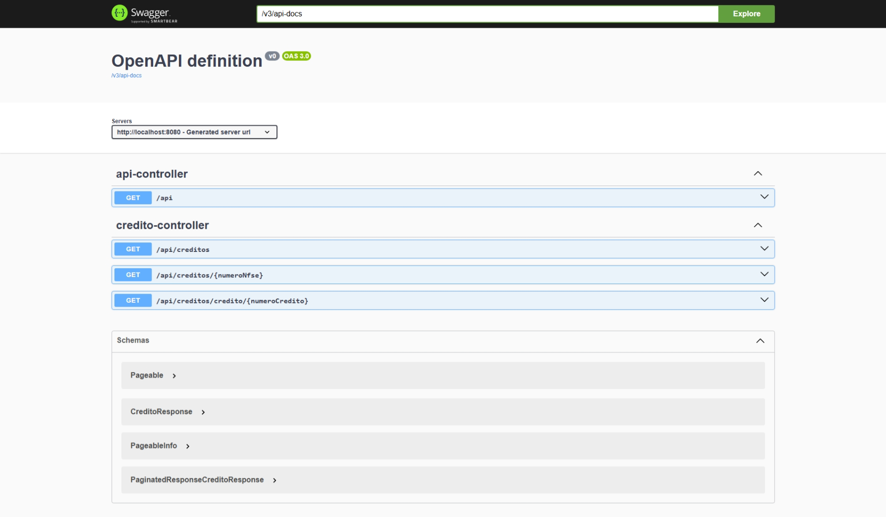
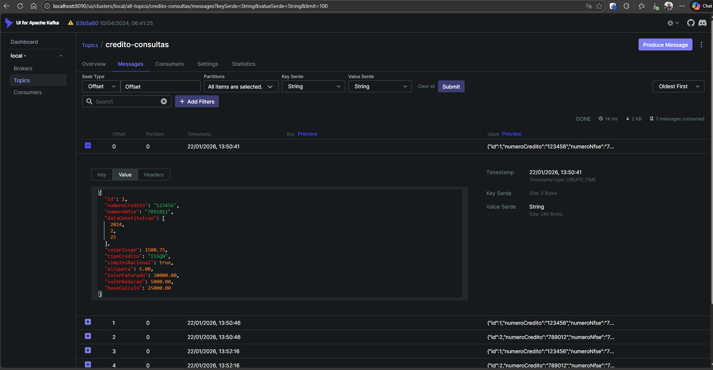
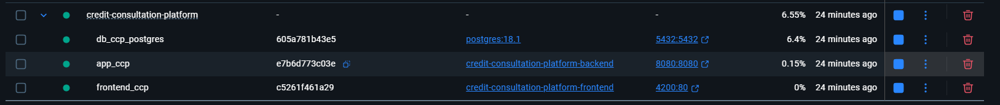

# Plataforma de Consulta de Créditos Constituídos

> **Solução para o Desafio Técnico – Infuse Tecnologia**

Uma aplicação Fullstack robusta, moderna e containerizada para consulta e gestão de créditos, desenvolvida com **Java 25**, **Spring Boot 3** e **Angular 21**.



---

## 🌟 Diferenciais e Extras Implementados

Este projeto vai além dos requisitos básicos do desafio, implementando práticas de mercado e tecnologias de ponta para entregar uma experiência superior de desenvolvimento e uso.

### Backend
*   **Flyway Migration**: Gerenciamento automatizado de versões do banco de dados. As tabelas e dados iniciais são criados automaticamente ao iniciar a aplicação, eliminando a necessidade de scripts manuais.
*   **Documentação com Swagger/OpenAPI**: Implementação não solicitada, mas adicionada para facilitar intgração com frontend.
*   **Endpoint de Listagem Geral**: Criação do endpoint `GET /api/creditos` para listar todos os registros, funcionalidade não prevista originalmente.
*   **Paginação Customizada**: Implementação de paginação otimizada (`PaginatedResponse`) nos endpoints de listagem para melhor performance e experiência no frontend.
*   **Testes do Backend via Docker & Docker Compose**: Pronto para rodar os testes sem precisar ter todo JDK em ambiente local.
*   **Java 25**: Utilização da versão mais recente da linguagem (LTS).
*   **Kafka Producer**: Integração com Apache Kafka para envio de eventos de consulta de crédito, simulando um cenário de auditoria ou processamento assíncrono.

### Frontend
*   **Menu Lateral**: Interface moderna com menu lateral para melhor navegação.
*   **Modal de Detalhes**: Exibição dos detalhes do crédito em um modal elegante, melhorando a usabilidade.
*   **Paginação e Ordenação**: Implementação completa de paginação e ordenação nas tabelas de consulta.
*   **Design Responsivo Aprimorado**: Layout adaptável que garante uma excelente experiência tanto em desktops quanto em dispositivos móveis.

---

## 🛠️ Tecnologias Utilizadas

| Backend | Frontend                     | Infraestrutura |
| :--- |:-----------------------------| :--- |
| ☕ **Java 25** | 🅰️ **Angular 21 (via CLI)** | 🐳 **Docker** |
| 🍃 **Spring Boot 3.5.9** | 🎨 **Angular Material**      | 🐙 **Docker Compose** |
| 🗄️ **Spring Data JPA** | 💅 **Tailwind CSS**          | 🐘 **PostgreSQL** |
| 🚀 **Flyway** | 🟦 **TypeScript**            | ☁️ **Swagger UI** |
| 🌶️ **Lombok** |                              | 📨 **Apache Kafka** |

---

## 📱 Galeria da Interface

A interface foi projetada para ser intuitiva e responsiva.

### Desktop
| Detalhes em Modal | Busca Filtrada |
| :---: | :---: |
|  |  |

### Mobile (Responsivo)
| Menu Lateral | Tela Principal | Detalhes do Crédito |
| :---: | :---: | :---: |
|  |  |  |

---

## 🏗️ Arquitetura e Design

O projeto segue os princípios de **Clean Code** e **SOLID**, com uma arquitetura em camadas bem definida:

*   **Domain**: Entidades JPA (`Credito`) representando o modelo de dados.
*   **Repository**: Interfaces para persistência de dados.
*   **Service**: Regras de negócio e transformação de DTOs.
*   **Controller**: Endpoints REST.
*   **DTO**: Objetos de transferência (`CreditoResponse`) para desacoplamento.

### 🔌 API e Documentação
A API é auto-documentada via Swagger UI.
*   **Acesso**: `http://localhost:8080/swagger-ui/index.html`



### 📨 Mensageria com Kafka
O sistema utiliza Kafka para notificar consultas realizadas.
*   **Kafka UI**: `http://localhost:8090`



---

## 🏃‍♂️ Como Executar

### Pré-requisitos
*   Docker e Docker Compose instalados.

### Passo a Passo

1.  **Clone o repositório.**
2.  **Configure as variáveis de ambiente:**
    ```bash
    cp .env.example .env
    ```
    *(O arquivo `.env` já vem com configurações padrão funcionais para desenvolvimento).*

3.  **Suba o ambiente completo (Back + Front + Banco + Kafka):**
    ```bash
    docker-compose up -d --build
    ```
    

4.  **Acesse a aplicação:**
    *   🖥️ **Frontend**: [http://localhost:4200](http://localhost:4200)
    *   ⚙️ **Backend API**: [http://localhost:8080](http://localhost:8080)
    *   📨 **Kafka UI**: [http://localhost:8090](http://localhost:8090)

    > **Nota:** Graças ao **Flyway**, o banco de dados será criado e populado automaticamente na primeira execução.

---

## 🧪 Testes Automatizados

O projeto inclui testes de integração e unidade no backend.

**Para rodar os testes de forma isolada (via Docker):**
```bash
docker-compose -f docker-compose.test.yaml up --build --abort-on-container-exit
```

### Evidências de Testes
|                           Teste Local (IDE)                           |                                       Teste via Docker Compose                                        |
|:---------------------------------------------------------------------:|:-----------------------------------------------------------------------------------------------------:|
|  |  |

---

## 📋 Requisitos Originais do Desafio

Para fins de conferência, abaixo estão os requisitos originais solicitados pela Infuse Tecnologia:

*   **Tecnologias**: Java 8+, Spring Boot, Spring Data JPA, Hibernate, Angular.
*   **Funcionalidades**:
    *   [x] Consulta de créditos Constituídos por número da NFS-e.
    *   [x] Exibição detalhada de um crédito.
    *   [x] Responsividade para dispositivos móveis.
    *   [x] Aplicação containerizada.

---

## 👨‍💻 Autor

Desenvolvido por **Edson Moretti do Nascimento**.
