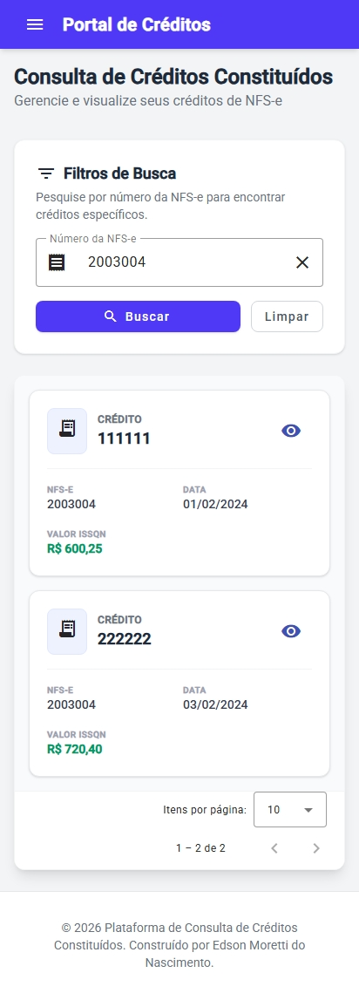

# Plataforma de Consulta de Créditos

Este projeto é uma solução para o **Desafio Técnico – Desenvolvimento de API de Consulta de Créditos** da **Infuse Tecnologia**.

## 📋 Requisitos do Desafio
O desafio solicitava originalmente o uso das seguintes tecnologias:
*   **Back-end**: Java 8+, Spring Boot, Spring Data JPA, Hibernate.
*   **Front-end**: Angular.
*   **Funcionalidades**:
    *   Consulta de créditos por número da NFS-e.
    *   Exibição detalhada de um crédito ao ser selecionado.
    *   Responsividade para dispositivos móveis.
    *   Aplicação containerizada.

## 🌟 Diferenciais e Extras Implementados
Além de atender aos requisitos obrigatórios, foram implementadas funcionalidades extras para enriquecer o projeto e demonstrar conhecimentos avançados:

### Backend
*   **Flyway Migration**: Gerenciamento automatizado de versões do banco de dados. As tabelas e dados iniciais são criados automaticamente ao iniciar a aplicação, eliminando a necessidade de scripts manuais.
*   **Documentação com Swagger/OpenAPI**: Implementação não solicitada, mas adicionada para facilitar o teste e visualização da API.
*   **Endpoint de Listagem Geral**: Criação do endpoint `GET /api/creditos` para listar todos os registros, funcionalidade não prevista originalmente.
*   **Paginação Customizada**: Implementação de paginação otimizada (`PaginatedResponse`) nos endpoints de listagem para melhor performance e experiência no frontend.
*   **Docker & Docker Compose**: Configuração completa de ambiente para facilitar a execução e testes.
*   **Java 25**: Utilização da versão mais recente da linguagem.

### Frontend
*   **Menu Lateral**: Interface moderna com menu lateral para melhor navegação.
*   **Modal de Detalhes**: Exibição dos detalhes do crédito em um modal elegante, melhorando a usabilidade.
*   **Paginação e Ordenação**: Implementação completa de paginação e ordenação nas tabelas de consulta.
*   **Design Responsivo Aprimorado**: Layout adaptável que garante uma excelente experiência tanto em desktops quanto em dispositivos móveis.

---

## 🚀 Tecnologias Utilizadas

### Backend
*   **Java 25**: Versão mais recente da linguagem.
*   **Spring Boot 3.5.9**: Framework para desenvolvimento ágil.
*   **Spring Data JPA**: Abstração para persistência de dados.
*   **Flyway**: Migração e versionamento de banco de dados.
*   **Lombok**: Redução de boilerplate code.
*   **PostgreSQL**: Banco de dados relacional (configurável via Docker).
*   **Swagger / OpenAPI**: Documentação interativa da API.

### Frontend
*   **Angular 21**: Framework moderno para construção de interfaces.
*   **Angular Material**: Componentes de UI de alta qualidade.
*   **Tailwind CSS**: Framework CSS utilitário para estilização rápida e responsiva.
*   **TypeScript**: Superset tipado de JavaScript.

## 🏗️ Arquitetura e Design

O projeto segue uma arquitetura em camadas bem definida no backend e uma estrutura modular no frontend.

### Backend
*   **Domain**: Entidades JPA (`Credito`) representando o modelo de dados.
*   **Repository**: Interfaces (`CreditoRepository`) para acesso a dados.
*   **Service**: Regras de negócio (`CreditoService`) e transformação de dados.
*   **Controller**: Endpoints REST (`CreditoController`) para exposição da API.
*   **DTO**: Objetos de transferência de dados (`CreditoResponse`) para desacoplar a API do modelo de persistência.

### Frontend
O frontend foi desenvolvido em Angular, consumindo a API REST do backend. A aplicação é totalmente responsiva e utiliza componentes do Angular Material para garantir consistência visual e usabilidade.

## 🔌 API Endpoints e Documentação

A API possui documentação interativa via Swagger UI.

*   **Acesso à Documentação**: `http://localhost:8080/swagger-ui/index.html`


### Endpoints Principais

*   `GET /api/creditos`: Retorna uma lista paginada de todos os créditos.
*   `GET /api/creditos/{numeroNfse}`: Retorna uma lista paginada de créditos associados a uma Nota Fiscal de Serviço Eletrônica (NFS-e).
*   `GET /api/creditos/credito/{numeroCredito}`: Retorna os detalhes de um crédito específico.

## 📱 Interface do Usuário (Frontend)

A interface foi projetada para ser intuitiva e responsiva. Abaixo estão algumas capturas de tela demonstrando as funcionalidades implementadas.

### Desktop
| Tela Principal | Detalhes do Crédito |
| :---: | :---: |
|  |  |

| Buscando Créditos |
| :---: |
|  |

### Mobile
| Menu Lateral | Tela Principal |
| :---: | :---: |
|  |  |

| Buscando Créditos | Detalhes do Crédito |
| :---: | :---: |
|  |  |

## 🛠️ Como Executar

### Pré-requisitos

*   Docker e Docker Compose instalados.

### Passos

1.  Clone o repositório.
2.  Na raiz do projeto, copie o arquivo de exemplo de variáveis de ambiente:

    ```bash
    cp .env.example .env
    ```

3.  Edite o arquivo `.env` recém-criado para ajustar as configurações conforme necessário (usuário, senha, tipo de banco, etc.). O arquivo já vem com valores padrão funcionais para um ambiente de desenvolvimento.

    ```env
    # Exemplo de configuração no .env
    DB_TYPE=postgres
    DB_VERSION=18.1
    DB_USER=usuario
    DB_PASSWORD=senha
    DB_NAME=db_creditos
    DB_PORT=5432
    # ... outras configurações
    ```

4.  **Subir o Ambiente (Aplicação + Banco de Dados):**

    Execute o comando abaixo para iniciar a aplicação (Backend e Frontend) e o banco de dados em containers:

    ```bash
    docker-compose up -d --build
    ```

    *   **Backend API**: Disponível em `http://localhost:8080`
    *   **Frontend**: Disponível em `http://localhost:4200` (ou a porta configurada no docker-compose para o frontend)

    > **Nota:** O arquivo `application.yaml` da aplicação já está configurado para ler automaticamente as variáveis de ambiente definidas no container pelo Docker Compose.
    >
    > **Flyway:** Graças à integração com o Flyway, o banco de dados será criado e populado automaticamente com os dados iniciais assim que a aplicação iniciar.

## 🧪 Testes

O projeto inclui testes automatizados para garantir a integridade das regras de negócio e da API.

### Executando Testes

Para rodar os testes automatizados de forma isolada, utilize o arquivo `docker-compose.test.yaml` criado especificamente para este fim:

```bash
docker-compose -f docker-compose.test.yaml up --build --abort-on-container-exit
```

Este comando irá:
1. Subir um container de banco de dados exclusivo para testes.
2. Construir e executar os testes da aplicação.
3. Encerrar os containers automaticamente após a conclusão dos testes.

### Evidências de Testes

**Teste Local (IDE):**


**Teste via Docker Compose:**


## 👨‍💻 Autor

Desenvolvido por **Edson Moretti** como parte do processo seletivo da Infuse Tecnologia.
