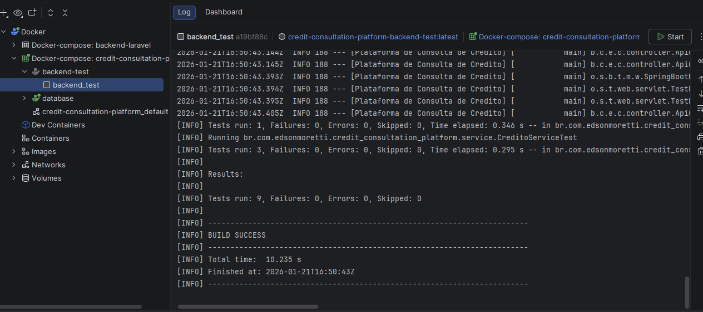

# Plataforma de Consulta de Créditos

Este projeto é uma solução para o **Desafio Técnico – Desenvolvimento de API de Consulta de Créditos** da **Infuse Tecnologia**.

O objetivo é fornecer uma API REST robusta e escalável para consulta de créditos, implementada com **Java 25**, **Spring Boot 3** e seguindo as melhores práticas de desenvolvimento como **Clean Code** e **SOLID**.

## 🚀 Tecnologias Utilizadas

*   **Java 25**: Versão mais recente da linguagem.
*   **Spring Boot 3.5.9**: Framework para desenvolvimento ágil.
*   **Spring Data JPA**: Abstração para persistência de dados.
*   **Lombok**: Redução de boilerplate code.
*   **PostgreSQL**: Banco de dados relacional (configurável via Docker).
*   **Docker & Docker Compose**: Containerização da aplicação e banco de dados.
*   **Swagger / OpenAPI**: Documentação interativa da API.

## 🏗️ Arquitetura e Design

O projeto segue uma arquitetura em camadas bem definida:

*   **Domain**: Entidades JPA (`Credito`) representando o modelo de dados.
*   **Repository**: Interfaces (`CreditoRepository`) para acesso a dados.
*   **Service**: Regras de negócio (`CreditoService`) e transformação de dados.
*   **Controller**: Endpoints REST (`CreditoController`) para exposição da API.
*   **DTO**: Objetos de transferência de dados (`CreditoResponse`) para desacoplar a API do modelo de persistência.

### Modelo de Dados (Entidade `Credito`)

A entidade `Credito` foi modelada para atender aos requisitos do desafio, contendo campos como:
*   `numeroCredito`, `numeroNfse`
*   `valorCredito`, `valorUtilizado`, `valorDisponivel`
*   `dataCarga`, `dataConstituicao`
*   `valorIssqn`, `tipoCredito`, `simplesNacional`
*   `aliquota`, `valorFaturado`, `valorDeducao`, `baseCalculo`

## 🔌 API Endpoints e Documentação

A API possui documentação via Swagger UI.

*   **Acesso à Documentação**: `http://localhost:8080/swagger-ui/index.html`


### Endpoints Principais

*   `GET /api/creditos`: Retorna uma lista paginada de todos os créditos.
*   `GET /api/creditos/{numeroNfse}`: Retorna uma lista paginada de créditos associados a uma Nota Fiscal de Serviço Eletrônica (NFS-e).
*   `GET /api/creditos/credito/{numeroCredito}`: Retorna os detalhes de um crédito específico.

### Paginação

Os endpoints de listagem utilizam uma estrutura de resposta paginada simplificada (`PaginatedResponse`) para facilitar a integração com o frontend e evitar poluição de dados desnecessários.

Exemplo de estrutura de resposta paginada:

```json
{
  "content": [ ... ],
  "pageable": {
    "pageNumber": 0,
    "pageSize": 10,
    "offset": 0
  },
  "totalPages": 1,
  "totalElements": 5,
  "size": 10,
  "number": 0,
  "first": true,
  "last": true,
  "numberOfElements": 5,
  "empty": false
}
```

## 🛠️ Como Executar

### Pré-requisitos

*   Docker e Docker Compose instalados.

### Passos

1.  Clone o repositório.
2.  Na raiz do projeto, copie o arquivo de exemplo de variáveis de ambiente:

    ```bash
    cp .env.example .env
    ```

3.  Edite o arquivo `.env` recém-criado para ajustar as configurações conforme necessário (usuário, senha, tipo de banco, etc.). O arquivo já vem com valores padrão funcionais para um ambiente de desenvolvimento.

    ```env
    # Exemplo de configuração no .env
    DB_TYPE=postgres
    DB_VERSION=18.1
    DB_USER=usuario
    DB_PASSWORD=senha
    DB_NAME=db_creditos
    DB_PORT=5432
    # ... outras configurações
    ```

4.  Execute o comando para subir a aplicação e o banco de dados:

    ```bash
    docker-compose up -d --build
    ```

    A API estará disponível em `http://localhost:8080`.
    ao acessar você deverá ser redirecionado para documentação da API (`http://localhost:8080/swagger-ui/index.html`)

    > **Nota:** O arquivo `application.yaml` da aplicação já está configurado para ler automaticamente as variáveis de ambiente definidas no container pelo Docker Compose.

## 🧪 Testes

O projeto inclui testes automatizados para garantir a integridade das regras de negócio e da API.

### Executando Testes

Para rodar os testes automatizados dentro do container:

```bash
docker-compose up backend-test
```

### Evidências de Testes

**Teste Local (IDE):**


**Teste via Docker Compose:**


## 👨‍💻 Autor

Desenvolvido por **Edson Moretti** como parte do processo seletivo da Infuse Tecnologia.
