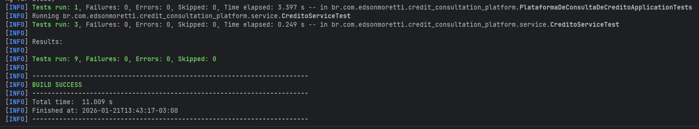

# Backend - Plataforma de Consulta de Créditos Constituídos

Este diretório contém o código-fonte do serviço de backend da aplicação, desenvolvido com **Java 25** e **Spring Boot 3**.

## 🚀 Tecnologias Utilizadas

*   **Java 25**: Versão mais recente da linguagem.
*   **Spring Boot 3.5.9**: Framework para desenvolvimento ágil.
*   **Spring Data JPA**: Abstração para persistência de dados.
*   **Flyway**: Migração e versionamento de banco de dados.
*   **Lombok**: Redução de boilerplate code.
*   **PostgreSQL**: Banco de dados relacional.
*   **Swagger / OpenAPI**: Documentação interativa da API.
*   **JUnit 5 & Mockito**: Testes unitários e de integração.

## 🏗️ Arquitetura

O projeto segue os princípios de **Clean Code** e **SOLID**:

*   **Domain**: Entidades JPA (`Credito`).
*   **Repository**: Interfaces `JpaRepository`.
*   **Service**: Regras de negócio.
*   **Controller**: Endpoints REST.
*   **DTO**: Objetos de transferência (`CreditoResponse`, `PaginatedResponse`).

### Destaques da Implementação

1.  **Flyway Migration**:
    *   O banco de dados é gerenciado automaticamente.
    *   Scripts em `src/main/resources/db/migration` criam tabelas e inserem dados iniciais.

2.  **Paginação Customizada**:
    *   Implementação de `PaginatedResponse` para simplificar o JSON de resposta do Spring Data, facilitando o consumo pelo frontend.

3.  **Documentação Automática**:
    *   Swagger UI disponível em `/swagger-ui/index.html`.

## 🔌 API Endpoints

*   `GET /api/creditos`: Lista paginada de todos os créditos.
*   `GET /api/creditos/{numeroNfse}`: Busca por NFS-e.
*   `GET /api/creditos/credito/{numeroCredito}`: Busca detalhada por ID do crédito.


## 🛠️ Como Executar (Localmente)

### Pré-requisitos
*   JDK 25 instalado.
*   Banco de dados PostgreSQL rodando (ou configurado via Docker).

### Passos
1.  Configure as variáveis de ambiente no `application.yaml` ou via variáveis de sistema (veja `.env.example` na raiz).
2.  Execute o projeto:
    ```bash
    ./mvnw spring-boot:run
    ```

## 🧪 Testes

O projeto possui testes automatizados cobrindo as camadas de serviço e controller.

### Executando Testes
```bash
./mvnw test
```

### Evidências
| Teste Local (IDE) | Teste via Docker Compose |
| :---: | :---: |
|  |  |
